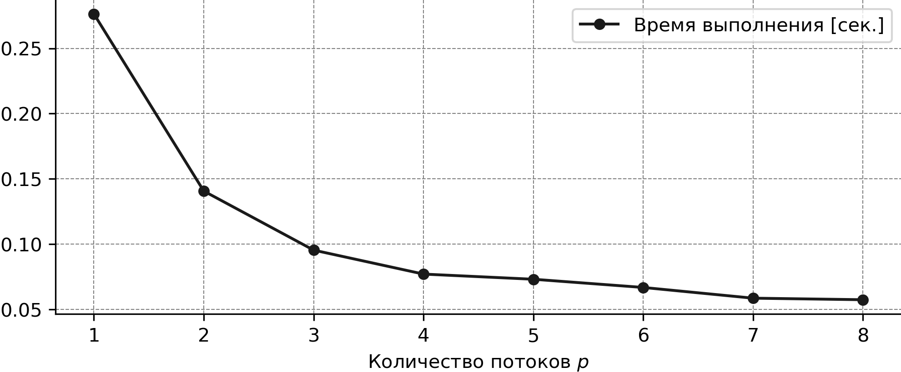
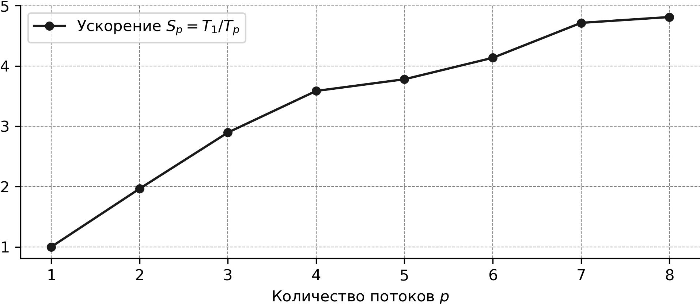
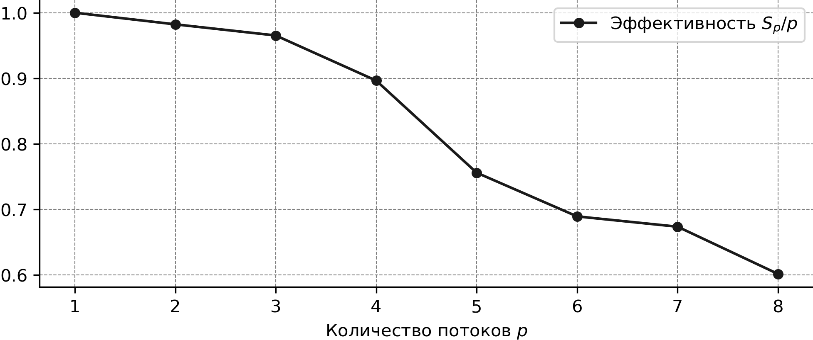
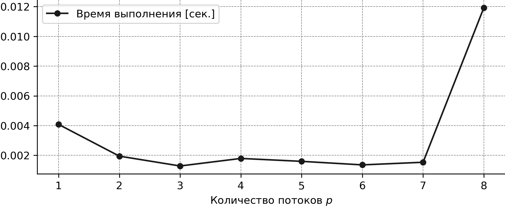
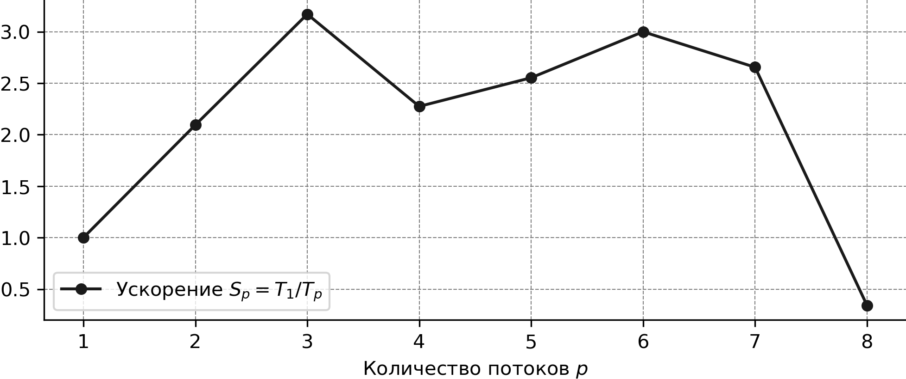

# Лабораторная работа 1

Генералов Даниил, 1032212280

## Задание 1

В этом задании мы используем директивы OpenMP для того, чтобы превратить последовательный цикл в параллельный.
Тело каждой из трех функций по редукции массива выглядит следующим образом:

```f90
S = 0.0
!$omp parallel shared(A) num_threads(ths_num)
!$omp do reduction(+:S)
    do i = 1, length
    S = S + A(i)
    end do
!$omp end do
!$omp end parallel
```

Сначала итоговая переменная инициализируется каким-то нейтральным значением:
для суммирования это ноль, а для максимума/минимума это может быть положительная или отрицательная бесконечность,
или же любой элемент массива.

После этого в блоке `!$omp parallel` мы указываем, какие переменные следует делить между потоками (в данном случае -- только массив `A`).
Внутри этого блока находится блок `!$omp do reduction`: он берет цикл, находящийся внутри себя,
и превращает его из последовательного цикла по всем `length` элементам в несколько циклов, которые выполняются параллельно над кусками массива.
После завершения цикла значение в итоговой переменной для каждого потока редуцируется по указанному правилу:
в данном случае, значение `S` в итоге равно сумме значений `S` в каждом потоке.

При тестировании для каждого метода редукции создается три рисунка.
Они выглядят похоже для каждого метода, поэтому здесь будут показаны только рисунки для метода суммирования.



На рисунке [time](lab2/imgs/reduction_sum/time.png) показывается, сколько времени требовалось для суммирования массива
против количества потоков, которые были использованы для этого. 
Видно, что время уменьшается с большим количеством потоков.
(Для некоторых операций, вроде максимума/минимума, иногда значение времени для 5 потоков больше, чем для 4 потоков --
насколько я понимаю, это связано с тем, что в моем компьютере на самом деле только 4 физических ядер,
которые используют _hyper-threading_; из-за этого синхронизация между 5 потоками требует больше усилий, чем между 4 потоками.)



График ускорения показывает, насколько быстрее было суммирование массива с N потоками, чем с одним:
например, когда задача была разделена на два потока, она была выполнена почти в два раза быстрее.



График эффективности показывает степень потери производительности при разделении задачи на N потоков.

Так называемые _embarrassingly parallel_-задачи могут быть очень легко разделены на несколько потоков:
например, рендеринг 3D-видео, brute-force поиск в криптографии, или тренировка генетических алгоритмов.
В таких задачах почти нулевая стоимость распределения задачи: если запустить ее на 1000 компьютерах, то можно получить результат ровно в 1000 раз быстрее.

Другие задачи имеют необходимый компонент линейности, из-за чего разделение их на несколько процессов не дает такого же бонуса к эффективности:
10 поваров не приготовят торт в 10 раз быстрее.
Эффективность параллелизации измеряет, насколько легко разделить задачу на несколько процессов и выполнять их параллельно.

В нашем случае суммирования массива, мы хотели бы, чтобы при разделении задачи на 8 потоков она была выполнена в 8 раз быстрее.
Но по графику ускорения видно, что она была выполнена всего лишь в 5 раз быстрее --
следовательно, эффективность такого разделения была 0.625. 

## Задание 2

В этом задании мы считаем интеграл функции с помощью параллельного цикла.
Для этого сначала мы суммируем элементы цикла интеграции:
каждый из них равен площади прямоугольника под функцией с высотой, равной значению функции, и шириной `h`.
Внутри цикла OpenMP отрезки функции интеграции распределяются между потоками,
и в конце добавляются точки на краях диапазона интеграции.

```f90
h = (b - a) / n
res = 0

!$omp parallel shared(a, n, h) num_threads(threads_num)
!$omp do reduction(+:res)
do i = 1, n - 1
    res = res + (func(a + i * h) * h)
end do
!$omp end do
!$omp end parallel

res = res + h * 0.5 * (func(a) + func(b))
```

В результате также получаются три рисунка:



На рисунке времени можно увидеть, что запуск с большим количеством потоков дает некоторое ускорение, но это ускорение быстро упирается в пол приблизительно на уровне 0.002сек, а затем, на 8 потоках, происходит резкое замедление, когда запуск занимает 0.012с.
Такой результат повторялся несколько раз.
У меня нет хорошего объяснения, почему так происходит: 
возможно, из-за того что задача и так быстро считается, разделение ее по потокам не приводит к улучшению,
а необходимость синхронизации выполнения всех 8 потоков приводит к каким-то патологическим случаям в ядре Linux.



Ускорение линейно до 3 потоков, а затем колебается около 2x-3x, за исключением этого аномального случая с 8 потоками, который оказался медленнее чем 1x -- то есть делать это в один поток выгоднее.


Эффективность выполнения даже выше единицы для случая с двумя и тремя потоками:
опять же, я не целиком уверен, почему это так,
но возможно разделение цикла на несколько потоков делает так,
что разным потокам достаются области интегрируемой функции, которые ведут себя по-разному,
и из-за этого branch-predictor в процессоре легче распознает, что происходит, если эти области считаются в разных потоках.
Дальше эффективность снижается, как и обычно,
и в случае 8 потоков она становится очень близкой к нулю,
отражая это аномальное замедление.
